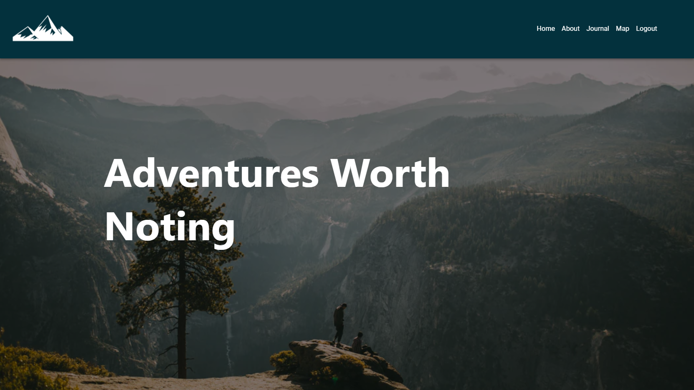
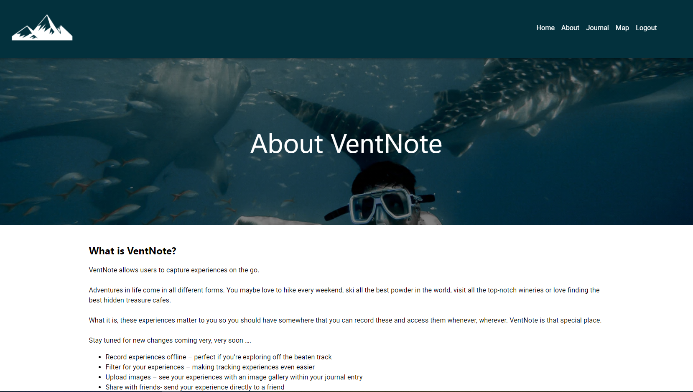
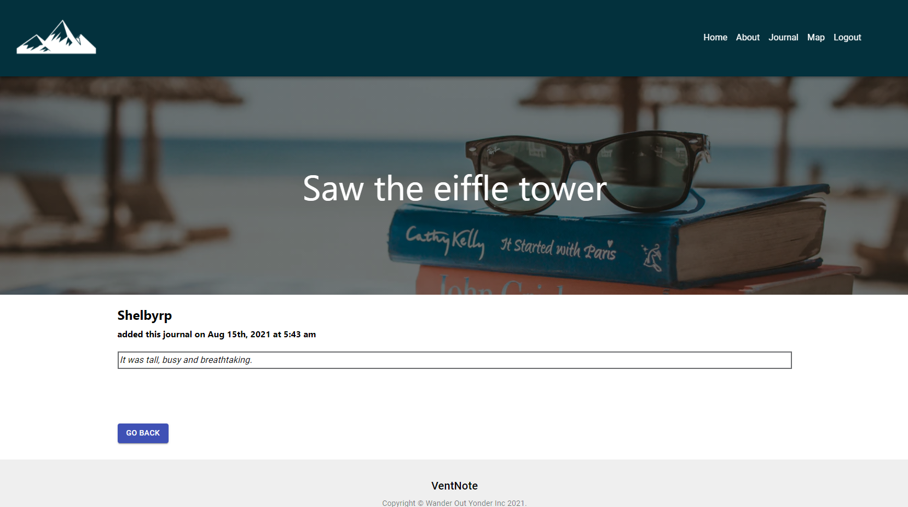
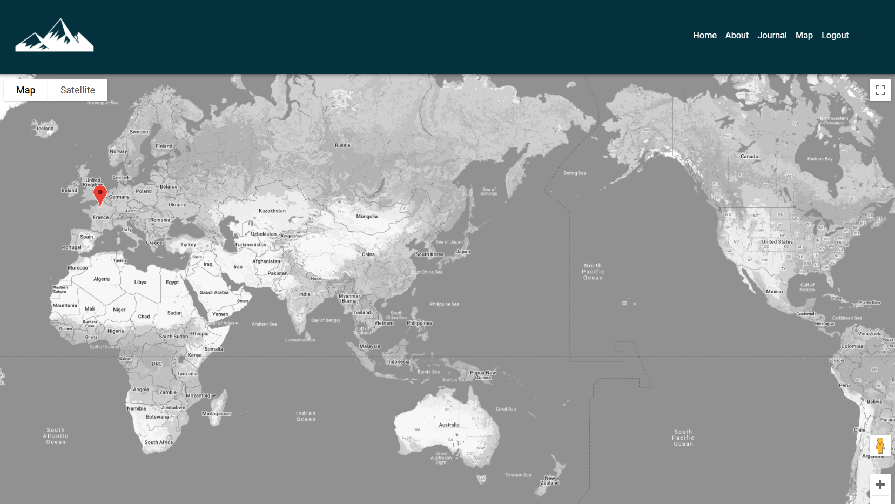

# VentNote

Adventures Worth Noting

[](https://opensource.org/licenses/MIT)

## Description

VentNote allows users to capture experiences on the go.

Adventures in life come in all different forms. You maybe love to hike every weekend, ski all the best powder in the world, visit all the top-notch wineries or love finding the best hidden treasure cafes. What it is, these experiences matter to you so you should have somewhere that you can record these and access them whenever, wherever. VentNote is that special place.

This application was built using React & Material UI for the front end, GraphQL with Node.js and Express server and MongoDB and the mongoose ODM for the database.

Link to the Heroku application for "VentNote": [view app](https://ventnote.herokuapp.com/).

## Table of Contents

- [Installation](#installation)
- [Usage](#usage)
- [License](#license)
- [Contributing](#contributing)
- [Credits](#credits)
- [Tests](#tests)
- [Questions](#questions)

## Installation

Clone these files from the GitHub repository via your preferred means. Then make sure to install necessary dependencies by running the following commands:

```
npm install
```

## Usage

Once the files have been pull down to your preferred repository, run this application by inputting 'npm run develop' into your bash terminal for the client and the server. The server will start. You can then view the application in the default browser.







## License

This project is licensed by the [MIT](https://opensource.org/licenses/MIT) license

## Contributing

If this project is of interest to you, please contact me with a detailed description of how you would like to contribute prior to any pull requests.

## Credits

https://www.mongodb.com/

https://devcenter.heroku.com/categories/reference

https://www.npmjs.com/package/graphql

https://www.apollographql.com/docs/react/

https://material-ui.com/getting-started/usage/

https://developers.google.com/maps/documentation/javascript/get-api-key

https://github.com/vuonga1103/responsive-header-tutorial/blob/master/src/Header.js

https://www.canva.com/

## Tests

If you have any questions or require further clarification then please contact me at:

- https://github.com/Shelbyrp/
- shelby.pignat@gmail.com
